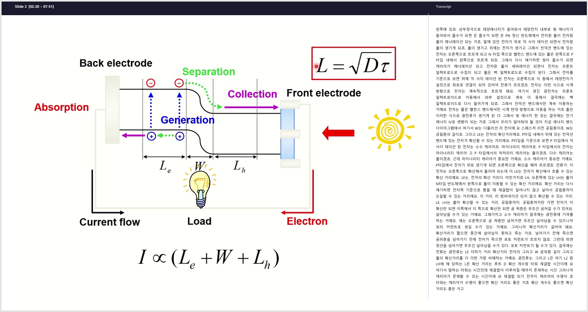

<div align="center">

# 🎓 SlideScribe

**Turn any lecture video into a structured, readable note — automatically.**

[](https://github.com/YMJ-02/SlideScribe/releases/latest)
[](https://github.com/YMJ-02/SlideScribe/releases)
[](LICENSE)
[](https://www.python.org/)
[](https://github.com/YMJ-02/SlideScribe/actions/workflows/ci.yml)
[](https://github.com/YMJ-02/SlideScribe/actions/workflows/release.yml)

</div>

---

Most tools give you a raw transcript. SlideScribe gives you a structured note — each slide paired with what was actually said about it.

Drop a lecture video into a visionOS-styled web UI. Get back a paginated document with every slide matched to its spoken content, ready to read or export.

---

## Example Note Preview



---

## Quick install — Windows

The fastest way to use SlideScribe: download the installer.

1. Go to the **[latest release](https://github.com/YMJ-02/SlideScribe/releases/latest)**
2. Download `SlideScribe-Setup-x.y.z.exe` from the Assets section
3. Double-click → **Next → Next → Install**
4. Launch from the Start Menu / Desktop shortcut — a browser tab opens automatically

> Python · FFmpeg · CUDA are **bundled into the installer**. You don't need to install anything else.
> The Whisper model (~1.5 GB) is downloaded on first transcription.
> Internet is only needed for that first download.

**Data location after install:**

| | Path |
|---|---|
| Program files | `C:\Program Files\SlideScribe\` |
| User data (config, outputs, tmp) | `%LOCALAPPDATA%\SlideScribe\` |

Uninstalling removes the program but **preserves** user data.

---

## How It Works

```
Video / Audio file
  ↓
  Pick a mode  ───  Slides + Transcript  (default)
                    Slides only          (skip Whisper — fastest)
                    Transcript only      (skip slide detection)
  ↓
  Slide segmentation     ── multi-signal change scoring
                           (SSIM + dHash + colour-histogram + edges)
                           with rolling-window adaptive threshold
  ↓
  Audio extraction + Whisper STT (faster-whisper, CUDA when available)
  ↓
  Timestamp matching (slide ↔ transcript)
  ↓
  Export → HTML / PDF / Markdown
```

Audio inputs (`.mp3`, `.wav`, `.m4a`, …) automatically fall into Transcript-only mode — Stage 1/2 are skipped.

### Mode comparison

| Mode | Stage 1<br>slides | Stage 4<br>Whisper | Output |
|---|:-:|:-:|---|
| `both` (default) | ✓ | ✓ | Slide page · transcript column · slides PDF · transcript.txt |
| `slides` | ✓ | – | Slide pages · slides PDF (no transcript) — **fastest** |
| `whisper` | – | ✓ | Transcript-only note · transcript.txt |

---

## For developers — run from source

### Requirements

- Python 3.10–3.13
- NVIDIA GPU with CUDA 12 (optional — falls back to CPU/int8 if absent)
- `ffmpeg` on `PATH`

### Install ffmpeg

| OS | Command |
|---|---|
| Windows | `winget install Gyan.FFmpeg` |
| macOS | `brew install ffmpeg` |
| Ubuntu/Debian | `sudo apt install ffmpeg` |

### Clone + dependencies

**Windows (one-click):**
```bat
git clone https://github.com/YMJ-02/SlideScribe.git
cd SlideScribe
install.bat
```
`install.bat` installs all Python deps + CUDA libraries + registers DLL paths.

**macOS / Linux:**
```bash
git clone https://github.com/YMJ-02/SlideScribe.git
cd SlideScribe
pip install -r requirements.txt
```

> CPU-only? Edit `config.yaml`:
> ```yaml
> stt:
>   device: "cpu"
>   compute_type: "int8"
> ```

### Run the web UI

```bash
python app.py                       # default localhost:7860
python app.py --port 8000
python app.py --host 127.0.0.1
```

Open `http://localhost:7860`. Drop files, pick a mode, click **Generate**, download the ZIP.

### Run the CLI

```bash
python run.py lecture.mp4                          # default mode = both
python run.py lecture.mp4 --mode slides            # slides only (fastest)
python run.py lecture.mp4 --mode whisper           # transcript only
python run.py lecture1.mp4 lecture2.mp4 --mode both
python run.py lecture.mp4 --format markdown        # html | pdf | markdown
python run.py lecture.mp4 --config my_config.yaml
```

---

## config.yaml reference

```yaml
pipeline:
  default_mode: "both"           # both | slides | whisper

slide_detection:
  frame_sample_rate: 2.0         # fps — higher catches faster cuts
  sensitivity: 2.5               # lower = more slides detected (1.5–4.0)
  merge_score: 0.07              # higher = merges more near-duplicates
  min_slide_sec: 2.0             # short slides are merged into neighbours

stt:
  model_name: "large-v3"         # tiny | base | small | medium | large-v3
  device: "cuda"                 # cuda | cpu
  compute_type: "float16"        # float16 (GPU) | int8 (CPU)
  language: "auto"               # language code, or auto
  batch_size: 8                  # lower if VRAM is tight
  kospacing: true                # Korean spacing post-process (source-only)

export:
  format: "html"                 # html | pdf | markdown
  embed_images: true

paths:
  output_dir: "output"
  tmp_dir: ".tmp"
```

---

## Project structure

```
SlideScribe/
├── app.py                # FastAPI app + job queue + REST endpoints
├── run.py                # CLI entry / shared pipeline orchestrator
├── launcher.py           # bundled-exe entry point (browser auto-open)
├── config.yaml           # default config (copied to %LOCALAPPDATA% on first run)
├── install.bat           # one-click dev setup on Windows
├── requirements.txt
├── web/                  # visionOS-styled SPA
│   ├── index.html
│   ├── style.css
│   └── app.js
├── stages/               # 6-stage pipeline
│   ├── stage1_segment.py   # multi-signal slide detection
│   ├── stage2_pdf.py       # slide-image PDF
│   ├── stage3_audio.py     # ffmpeg → 16 kHz mono WAV
│   ├── stage4_stt.py       # faster-whisper STT
│   ├── stage5_match.py     # slide ↔ transcript matching
│   └── stage6_export.py    # HTML / PDF / Markdown note
├── build/                # Windows installer build scripts (see build/README.md)
│   ├── slidescribe.spec    # PyInstaller spec
│   ├── installer.iss       # Inno Setup script
│   ├── build.bat           # local build runner
│   └── bin/                # drop ffmpeg.exe here to bundle it
├── .github/workflows/
│   ├── ci.yml              # lint
│   └── release.yml         # tag push → Windows build → GitHub Release
└── docs/                 # screenshots, demo HTML
```

---

## Building the installer yourself

Tag-based: push `vX.Y.Z` and the [release workflow](.github/workflows/release.yml) builds + publishes automatically.

```bash
git tag v0.3.0
git push origin v0.3.0
# → SlideScribe-Setup-0.3.0.exe appears in /releases within ~15 min
```

Local: see [`build/README.md`](build/README.md). TL;DR — `pip install pyinstaller`, then `build\build.bat`, then `iscc build\installer.iss`.

---

## FAQ

**Q. App crashes on first launch / console closes immediately.**
A. The launcher writes a `crash.log` to `%LOCALAPPDATA%\SlideScribe\`. Open it. Most likely cause is a missing module — file an issue with the traceback attached.

**Q. Output note is empty / has very few slides.**
A. Lower `sensitivity` in the UI (or `config.yaml`) to `2.0`. Reduce `min_slide_sec` to `1.0`. Raise `frame_sample_rate` to `3.0` if there are very quick cuts.

**Q. CUDA out of memory.**
A. Lower `batch_size` (e.g. `4`), switch to a smaller `model_name` (`medium` / `small`), or `device: cpu`.

**Q. `Library cublas64_12.dll is not found` (source install).**
A. Run `install.bat`, or manually `pip install nvidia-cublas-cu12 nvidia-cudnn-cu12`.

**Q. Whisper model download is stuck.**
A. The model lives in `~/.cache/huggingface/`. Delete and retry. On Windows, enable Developer Mode to fix symlink-related cache issues.

**Q. `ffmpeg not found` (source install).**
A. `ffmpeg -version` must succeed in your terminal. Add ffmpeg's `bin` to `PATH`.

**Q. The installer's bundled GPU mode doesn't work on my machine.**
A. The release workflow currently ships a CPU-friendly build. For GPU, install from source (`install.bat`) or build the installer locally with the `nvidia-*-cu12` packages present — the PyInstaller spec auto-bundles their DLLs.

---

## References

- [faster-whisper](https://github.com/SYSTRAN/faster-whisper) — CTranslate2-based Whisper inference
- [OpenAI Whisper](https://github.com/openai/whisper) — original model
- [scikit-image](https://scikit-image.org/) — SSIM
- [FastAPI](https://fastapi.tiangolo.com/) + [uvicorn](https://www.uvicorn.org/) — web stack
- [fpdf2](https://py-fpdf2.readthedocs.io/) — PDF generation
- [Inno Setup](https://jrsoftware.org/isinfo.php) — Windows installer
- [PyInstaller](https://pyinstaller.org/) — Python → exe bundler

---

## License

MIT. See [LICENSE](LICENSE).

---

## Issues / Bug reports

Open an issue at https://github.com/YMJ-02/SlideScribe/issues. Include:
- OS, Python version
- Installation method (installer vs source)
- GPU model (or CPU-only)
- Exact reproduction steps
- `%LOCALAPPDATA%\SlideScribe\crash.log` if applicable

---

<br/>

# 🎓 SlideScribe (한국어)

대부분의 도구는 원시 트랜스크립트만 줍니다. SlideScribe 는 **각 슬라이드에 그 슬라이드에서 실제로 한 말이 매칭된** 구조화된 노트를 만들어줍니다.

visionOS 스타일 웹 UI 에 강의 영상을 드롭하면, 슬라이드별로 정렬된 페이지 노트가 나옵니다.

---

## 빠른 설치 — Windows

1. **[최신 Release](https://github.com/YMJ-02/SlideScribe/releases/latest)** 페이지로 이동
2. Assets 에서 `SlideScribe-Setup-x.y.z.exe` 다운로드
3. 더블클릭 → **다음 → 다음 → 설치 완료**
4. 시작 메뉴 / 바탕화면 단축아이콘 클릭 → 브라우저가 자동으로 열림

> Python · FFmpeg · CUDA 라이브러리가 설치본에 **모두 포함**되어 있습니다. 별도로 설치할 필요 없음.
> Whisper 모델(~1.5 GB)은 첫 전사 시 자동 다운로드됩니다 (이때만 인터넷 필요).

| | 위치 |
|---|---|
| 프로그램 | `C:\Program Files\SlideScribe\` |
| 사용자 데이터 (설정·출력·임시) | `%LOCALAPPDATA%\SlideScribe\` |

제거해도 사용자 데이터는 **보존**됩니다.

---

## 작동 방식

```
영상 / 오디오 파일
  ↓
  모드 선택  ───  슬라이드 + 스크립트  (기본)
                  슬라이드만            (Whisper 생략 — 가장 빠름)
                  스크립트만            (슬라이드 감지 생략)
  ↓
  슬라이드 세그멘테이션  ── 4-신호 변화 점수
                          (SSIM + dHash + 색히스토그램 + 에지)
                          + 적응형 임계값 (rolling median + k·MAD)
  ↓
  오디오 추출 + Whisper STT (faster-whisper, GPU 가능 시 CUDA)
  ↓
  타임스탬프 매칭
  ↓
  내보내기 → HTML / PDF / Markdown
```

오디오 파일은 자동으로 스크립트 전용 모드로 전환됩니다.

| 모드 | Stage 1<br>슬라이드 | Stage 4<br>Whisper | 결과물 |
|---|:-:|:-:|---|
| `both` (기본) | ✓ | ✓ | 슬라이드 + 스크립트 노트, 슬라이드 PDF, transcript.txt |
| `slides` | ✓ | – | 슬라이드만 — 가장 빠름 |
| `whisper` | – | ✓ | 전사 텍스트 노트, transcript.txt |

---

## 개발자용 — 소스에서 실행

### 요구 사항
- Python 3.10 ~ 3.13
- NVIDIA GPU + CUDA 12 (선택 — 없으면 CPU/int8 자동 fallback)
- `ffmpeg` 가 PATH 에 등록되어 있어야 함

### 설치

**Windows (원클릭):**
```bat
git clone https://github.com/YMJ-02/SlideScribe.git
cd SlideScribe
install.bat
```

**macOS / Linux:**
```bash
git clone https://github.com/YMJ-02/SlideScribe.git
cd SlideScribe
pip install -r requirements.txt
```

### 실행

```bash
# 웹 UI
python app.py                  # http://localhost:7860

# CLI
python run.py lecture.mp4                    # mode=both (기본)
python run.py lecture.mp4 --mode slides      # 슬라이드만
python run.py lecture.mp4 --mode whisper     # 전사만
python run.py lecture.mp4 --format markdown
```

---

## 설치본 직접 빌드하기

태그 푸시만으로 자동 빌드:
```bash
git tag v0.3.0
git push origin v0.3.0
# → 약 15분 후 Releases 페이지에 SlideScribe-Setup-0.3.0.exe 자동 게시
```

로컬 빌드 가이드는 [`build/README.md`](build/README.md) 참조.

---

## FAQ

**Q. 실행하자마자 콘솔이 꺼져버려요.**
A. `%LOCALAPPDATA%\SlideScribe\crash.log` 를 확인하세요. 모듈 누락이 가장 흔한 원인입니다. traceback 을 첨부해 이슈를 올려주세요.

**Q. 출력 노트의 슬라이드 수가 너무 적어요.**
A. UI 의 `sensitivity` 를 `2.0` 으로 낮추세요. `min_slide_sec` 도 `1.0` 으로 줄이고, 빠른 컷이 많다면 `frame_sample_rate` 를 `3.0` 으로 올려보세요.

**Q. CUDA out of memory.**
A. `batch_size` 를 4 이하로, 또는 `model_name` 을 `medium`/`small` 로, 또는 `device: cpu` 로.

**Q. `Library cublas64_12.dll is not found` (소스 설치).**
A. `install.bat` 실행. 또는 `pip install nvidia-cublas-cu12 nvidia-cudnn-cu12`.

**Q. Whisper 모델 다운로드가 멈춤.**
A. `~/.cache/huggingface/` 의 캐시를 지우고 재시도. Windows 면 개발자 모드를 켜서 심볼릭 링크 문제 해결.

**Q. `ffmpeg not found` (소스 설치).**
A. `ffmpeg -version` 이 터미널에서 동작해야 함. PATH 등록 확인.

**Q. 설치본인데 GPU 가속이 안 돼요.**
A. GitHub Actions 의 자동 빌드는 CPU 프로파일로 만들어집니다. GPU 가속이 필요하면 소스에서 직접 실행 (`install.bat`) 하거나, `nvidia-*-cu12` 패키지를 설치한 상태에서 로컬로 `build\build.bat` 실행해 GPU 포함 설치본을 직접 만드세요.

---

## 라이선스

MIT. [LICENSE](LICENSE) 참조.
